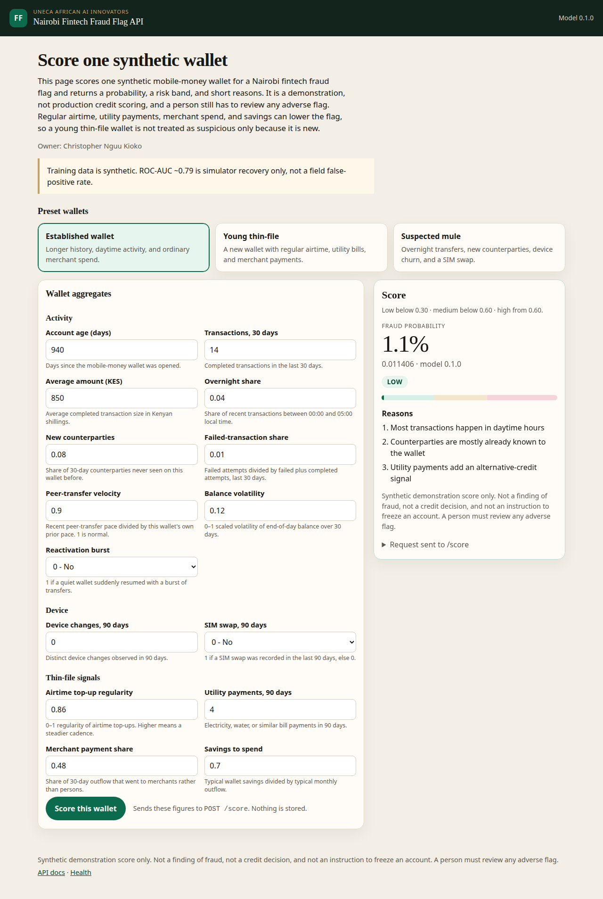

# Nairobi Fintech Fraud Flag API

[](https://github.com/ChristopherKiokoStrathmore/DSA-8401---CREDIT-LAB/actions/workflows/ci.yml)
[](https://www.python.org/downloads/)
[](LICENSE)

Owner: **Christopher Nguu Kioko**

A small, demoable scoring service for the UNECA African AI Innovators showcase
(deadline ~2 October 2026). `POST /score` turns synthetic mobile-money and
thin-file aggregates into a fraud **probability**, a **risk band**, and up to
three short **reasons**. The same score is on a browser page at `/`, so a
reviewer can try the example wallets without curl. This API is a classification
product built for the showcase. The data is simulated.

**Results (simulated data):** hold-out ROC-AUC is 0.7931761410831932, versus 0.5
for a prior dummy baseline (`DummyClassifier(strategy="prior")`). Those are
`test_roc_auc` and `dummy_prior_roc_auc` in `models/metadata.json`. Rescoring
the committed `models/nairobi_fraud_flag.joblib` on the same 12,000 synthetic
wallets (stratified 80/20 split, `random_state=42`) reproduces both figures.
They measure recovery of the simulator, not a field false-positive rate.

## Why this name

The course repository is a credit lab, and the Week 1 lecture tells a
credit-scoring story. The code that was already here predicts **price per unit
area**, not default. A pure alternative-credit probability-of-default model
would not match that baseline, and it would overclaim what a two-week demo can
know about repayment.

The showcase product is therefore the **Nairobi Fintech Fraud Flag API**: a
fraud-flag classifier on synthetic wallet behaviour. Alternative-credit signals
are inputs, not a second score. Regular airtime top-ups, utility payments,
merchant spend, and savings-to-spend can pull the fraud probability **down**,
so a new wallet without a bureau file is not treated as suspicious just because
it is new. Formal KYC tier is omitted on purpose. A lower KYC tier must not
raise the flag.

## Problem

Mobile money is how a large share of East African households save, get paid, and
pay bills. The same rails are abused by SIM-swap takeovers, mule wallets, and
overnight pass-through bursts. Those losses fall on customers who can least
afford them, and blunt fraud rules then punish the thin-file majority: young
wallets, informal traders, and anyone a traditional bureau has never seen.

This demo asks a narrower question than “should this person get a loan?”:

> Given **synthetic** behavioural aggregates for one wallet, what is the
> probability that the pattern resembles the simulated fraud process, which
> band does that sit in, and which features drove the score?

It does not accuse a person, decline credit, or file a suspicious-transaction
report. A human reviewer has to sit in front of any adverse flag.

## How to run

Python 3.11 or newer. From the repository root:

```bash
python -m venv venv
source venv/bin/activate          # Windows: venv\Scripts\activate
pip install -r requirements.txt
uvicorn app.main:app --host 127.0.0.1 --port 8000
```

The committed model artifact loads at startup. Open the demo in a browser:

<http://127.0.0.1:8000/>

`/demo` serves the same page.



Pick **Established wallet**, **Young thin-file**,
or **Suspected mule** (the files in `examples/`), edit any figure, and score it.
The page posts JSON to `/score` and shows the probability, risk band, and
reasons. Interactive API docs remain at <http://127.0.0.1:8000/docs>.

Check the process from a terminal, then score two checked-in wallets:

```bash
curl -s http://127.0.0.1:8000/health

curl -s -X POST http://127.0.0.1:8000/score \
  -H 'Content-Type: application/json' \
  -d @examples/established_wallet.json

curl -s -X POST http://127.0.0.1:8000/score \
  -H 'Content-Type: application/json' \
  -d @examples/suspected_mule.json
```

A thin-file inclusion example (new wallet, steady airtime and utility payments)
is in `examples/thin_file_inclusion.json`. Tests:

```bash
pytest
```

Retrain only if you change `app/synthetic.py` or the feature list. The script
rewrites `models/nairobi_fraud_flag.joblib` and `models/metadata.json`:

```bash
python -m app.train
```

## Host the demo for free

Local uvicorn is enough for a review on one laptop. To put the same page on a
public URL, use the Dockerfile. It binds to `0.0.0.0` and `$PORT`, defaulting
to **7860**. No API keys and no paid hardware are required for the Render path
below.

### Docker on your machine

```bash
docker build -t nairobi-fraud-flag .
docker run --rm -p 8000:7860 nairobi-fraud-flag
```

Open <http://127.0.0.1:8000/>. The image contains `app/`, `examples/`, and
`models/` only. The Week 1 notebook and real-estate CSV in `course/` stay out of the image.

### Deploy with the included Render Blueprint

`https://nairobi-fraud-flag.onrender.com` returns 404 and is not deployed.
Deploy with the included Render Blueprint until a service is live. The steps
below stay as the way to host it.

Render's free instance sleeps after inactivity. The first request after sleep
can take about a minute. No environment variables are required. Render sets
`PORT` itself.

1. Sign in at <https://dashboard.render.com> and choose **New → Blueprint**.
2. Connect the GitHub repository `ChristopherKiokoStrathmore/DSA-8401---CREDIT-LAB`.
3. Render reads `render.yaml` at the repo root. Apply it. The service name is
   `nairobi-fraud-flag`, the runtime is Docker, the plan is **Free**, and the
   health check is `/health`.
4. If that name is already taken on the account, change `name` in `render.yaml`
   before applying. Do not add secrets.
5. When the deploy is live, open the service URL. That URL is the demo. `/health`
   and `/score` are on the same host.

The manual equivalent, if you skip the Blueprint: **New → Web Service**, connect
the same repo, runtime **Docker**, instance type **Free**, health check path
`/health`, and leave environment variables empty.

### Hugging Face Spaces

The Dockerfile follows the Docker Space layout: it runs as uid **1000** and
listens on port **7860**. Creating a new Gradio or Docker Space currently
requires a paid Hugging Face plan (PRO, Team, or Enterprise), even though CPU
basic hardware has no hourly price after the Space exists. Use Render above
when the host has to be free. If you already have a plan that can create a
Docker Space:

1. Open <https://huggingface.co/new-space>. Name it `nairobi-fraud-flag` (or
   any unused name). Choose SDK **Docker** and hardware **CPU basic**. Do not
   add secrets.
2. Upload this repository, or clone the Space and copy in `Dockerfile`,
   `requirements.txt`, `app/`, `examples/`, and `models/`.
3. Put this block at the top of the Space README. If the upload replaced that
   README with this repository’s README, paste the block above the existing
   text. The GitHub README does not need it:

```yaml
---
title: Nairobi Fintech Fraud Flag
emoji: 🔍
colorFrom: green
colorTo: yellow
sdk: docker
app_port: 7860
---
```

4. Wait until the Space build is running, then open the Space URL.

## What `/score` returns

`GET /health` → `status`, product name, model version, data policy.

`POST /score` accepts one JSON object. Unknown fields are rejected, including
anything that looks like a phone number or national ID. Response:

| Field | Meaning |
| --- | --- |
| `probability` | Predicted probability of the **simulated** fraud label, from 0 to 1 |
| `risk_band` | `low` below 0.30, `medium` from 0.30 up to but not including 0.60, `high` at 0.60 and above |
| `reasons` | Up to three short phrases from the largest log-odds contributions |
| `model_version` | Artifact version (`0.1.0`) |
| `disclaimer` | Reminder that this is not an operational decision |

Reasons for `medium` and `high` name the features pushing the score up. Reasons
for `low` name the features pulling it down, including alternative-credit
signals when those dominate.

### Features

All of these are aggregates. Do not send names, MSISDNs, device identifiers, or
coordinates.

| Feature | Role in the demo |
| --- | --- |
| `account_age_days` | Longer history pulls risk down slightly. Age alone is a weak term. |
| `txn_count_30d`, `avg_txn_amount_kes` | Recent activity level and typical ticket size (KES). |
| `night_txn_ratio` | Share of transactions between 00:00 and 05:00. |
| `new_counterparty_ratio` | Share of counterparties new to this wallet. |
| `failed_txn_ratio` | Failed attempts over failed plus completed. |
| `device_change_count_90d`, `sim_swap_90d` | Device churn and a recent SIM swap. |
| `peer_transfer_velocity`, `balance_volatility`, `reactivation_burst` | Pace versus this wallet’s own norm, balance swings, quiet-then-burst. |
| `airtime_topup_regularity`, `utility_payment_count_90d`, `merchant_payment_ratio`, `savings_to_spend_ratio` | Thin-file / alternative-credit signals that can lower the flag. |

## Model

`models/nairobi_fraud_flag.joblib` is a scikit-learn `Pipeline`: `StandardScaler`
then `LogisticRegression`, fit on 12,000 synthetic wallets from
`app.synthetic.generate` (`random_state=42`). The split is 80/20, stratified,
and the test fold is scored once. A `DummyClassifier(strategy="prior")` is the
floor reported in `models/metadata.json`. Hold-out ROC-AUC on this simulation is
0.7931761410831932, and the prior dummy ROC-AUC is 0.5. The label is a noisy function of the same features, so those figures
measure recovery of the simulator. They are **not** a field false-positive rate
and must not be quoted as one.

The Week 1 discipline still applies: scale inside the pipeline, compare with a
dummy, do not treat a raw score as if it were a decision.

## Ethics

- **Synthetic data only.** The generator invents wallets. The API does not
  accept or store PII. The original lab CSV is a public property-price table,
  not a customer extract, and the fraud model does not read it.
- **Not an accusation.** A high band means “this synthetic pattern matches the
  simulator,” not “this person committed fraud.”
- **Human review.** Do not auto-freeze a wallet, file a law-enforcement report,
  or decline a loan from this response.
- **Inclusion.** Young wallets with regular airtime, utility payments, merchant
  spend, and savings are in the training mix specifically so thin files are not
  collapsed into the fraud class. KYC tier is not a feature.
- **No protected attributes.** Gender, ethnicity, religion, and precise location
  are not inputs. Reason codes are feature phrases, not demographic labels.
- **Honest metrics.** Publishing the simulated AUC as real-world performance
  would mislead a regulator, a lender, or a showcase jury.

## SDG and Agenda 2063

Safer mobile money and a route into finance for people without a bureau file
sit on two African policy tracks this demo is built to illustrate.

**Sustainable Development Goals**

- **SDG 1** (no poverty) and **SDG 8** (decent work and economic growth): fraud
  losses and locked accounts both push people out of the digital economy.
- **SDG 9** (industry, innovation, and infrastructure): the score runs on
  ordinary wallet aggregates, the kind a licensed fintech already stores.
- **SDG 10** (reduced inequalities): alternative-credit signals are allowed to
  lower the flag for thin-file customers instead of copying a bureau that has
  never seen them.
- **SDG 16** (peace, justice, and strong institutions): a flag without a human
  reviewer and a stated reason is not an acceptable control.

**Agenda 2063**

- **Aspiration 1** - a prosperous Africa based on inclusive growth and
  sustainable development, including **Goal 1** (a high standard of living and
  well-being) and **Goal 4** (transformed economies).
- Digital financial inclusion is part of that growth path: mobile-money rails
  that people trust, with controls that do not treat the unbanked as suspicious
  by default.

UNECA’s African AI Innovators track is the audience. The claim on the table is
a reproducible demo with a written limit, not a production AML or credit-bureau
system.

## Layout

```
app/                     FastAPI app, simulator, training, scoring
  main.py                GET /, GET /demo, GET /health, POST /score
  demo.py                browser demo (presets from examples/)
  templates/demo.html    demo markup and page script
  train.py               python -m app.train
examples/                curl payloads and demo presets (synthetic)
models/                  joblib pipeline + metadata.json
tests/test_score.py      /score and /health checks
tests/test_demo.py       demo page smoke test
Dockerfile               public demo image (Render, or a Docker Space)
render.yaml              Render free web service blueprint
course/                  Week 1 lab: Real estate.csv and AML_Week_1.ipynb
src/baseline_pipeline.py Week 1 regression baseline (reads course/Real estate.csv)
```

## Week 1 lab

Applied Machine Learning, MSc Data Science & Analytics (Strathmore University).
DSA 8401, Week 1: an end-to-end **baseline**. The real-estate CSV and notebook
are in `course/` (`course/Real estate.csv`, `course/AML_Week_1.ipynb`).

The lab walks the ML lifecycle once on a small public dataset. The goal is not
a clever model. It is a **leak-free baseline** that later techniques have to beat.

### Problem framing

Given a property's characteristics, predict its **price per unit area**. This is
supervised **regression**. The baseline to beat is "always predict the mean
price" (`DummyRegressor`).

The Week 1 lecture tells a credit-scoring story. This lab’s dataset is the real
estate valuation set: same lifecycle, different target (regression, not
classification). The showcase fraud-flag API above is the classification
product; it does not replace this baseline.

### Run the baseline

```bash
python src/baseline_pipeline.py
```

This loads the data, splits it (test set touched once), fits a mean baseline and
a scaled linear regression inside a leak-free `Pipeline`, cross-validates on the
training data, and reports lift over the baseline.

### Disciplines

1. Split before fitting anything; the test set is sacred.
2. Learn preprocessing inside the pipeline, on training folds only.
3. Ship a baseline first and report lift, never a raw score alone.
4. Cross-validate on train; keep the test set sealed until the end.

## License of the claims

Course lab material stays in-tree. The fraud-flag layer is a student showcase
prototype by Christopher Nguu Kioko for UNECA African AI Innovators. It is not
an offer of a regulated scoring service.
